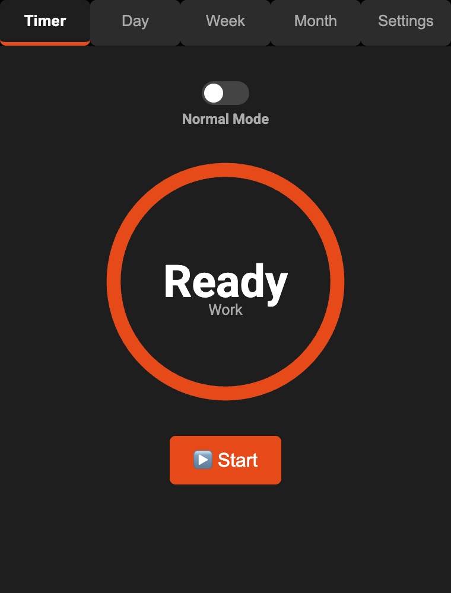
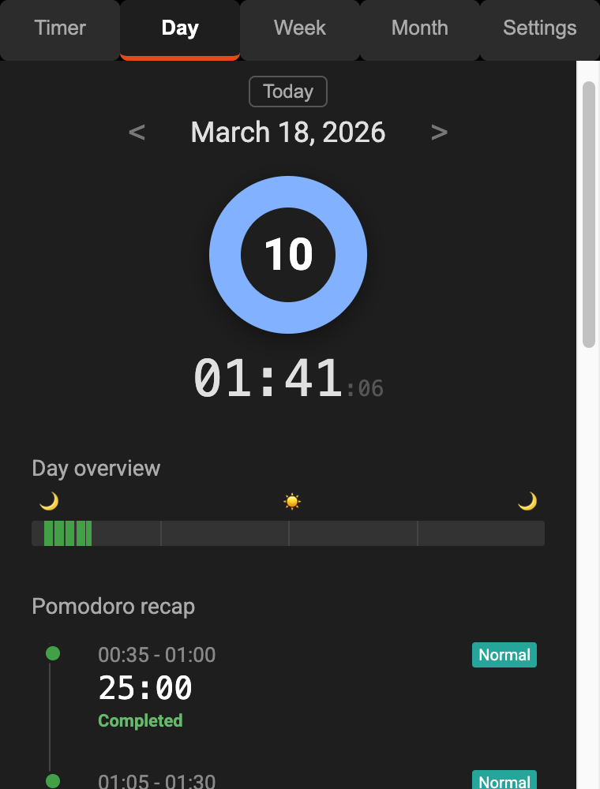
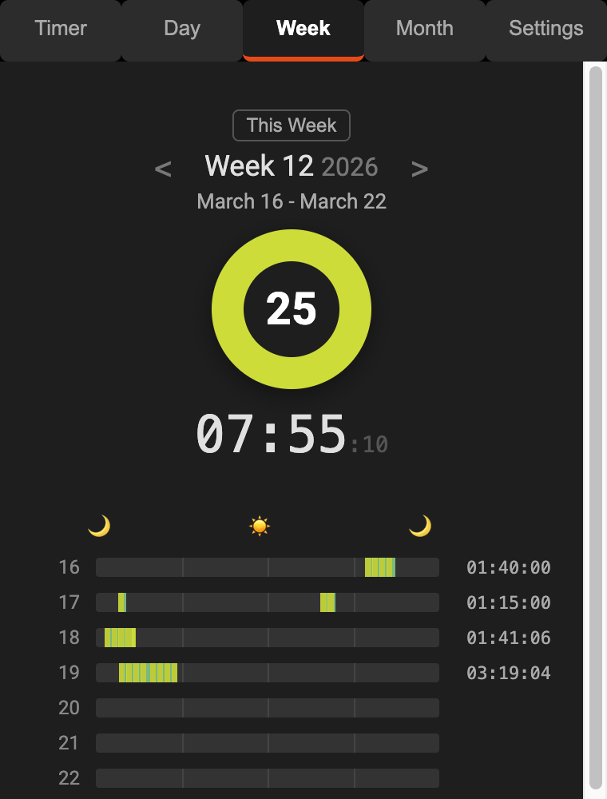
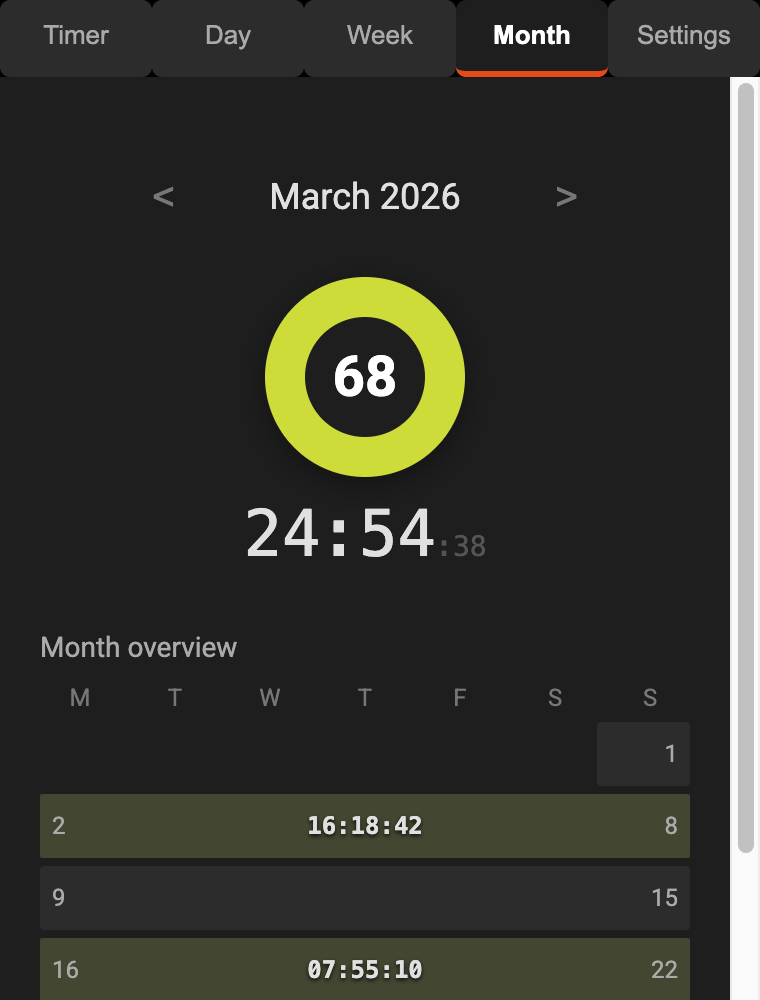

  

# Po-My-Doro

  *A powerful, aesthetic, and privacy-focused Pomodoro timer extension for Chrome, Edge, Brave, and other Chromium-based browsers.*
  
  

A modern browser extension designed to boost your productivity using the Pomodoro technique. It features multiple timer modes, local-first data storage, and rich analytics to help you focus.

## Screenshots

<table>
  <tr>
    <td align="center"><strong>Timer</strong>  </td>
    <td width="20"></td>
    <td align="center"><strong>Day</strong>  </td>
    <td width="20"></td>
    <td align="center"><strong>Week</strong>  </td>
    <td width="20"></td>
    <td align="center"><strong>Month</strong>  </td>
  </tr>
</table>

## Features

- **Dual Timer Modes**
  - **Normal Mode**: Classic Pomodoro technique (Work 25m, Short Break 5m, Long Break 15m) with automatic transitions.
  - **Focused Mode**: Stopwatch-style timer for unconstrained deep work sessions. Tracks exact time spent.
- **Audio Notifications**
  - Subtle clock sounds, pre-end warnings, and completion chimes managed reliably via an offscreen document.
- **Rich History & Analytics**
  - Day, week, and month views. Visual timeline differentiating session types. Automatically categorizes by completed and paused states.
- **Offline First & Private**
  - All data is stored locally in `chrome.storage.local`. Supports JSON export/import for device migration without data loss.

## Installation

### Chrome Web Store

<!-- TODO: Add Chrome Web Store link after publishing -->
Coming soon.

### Local Development

1. Clone this repository, or download the latest zip from the [Releases](../../releases) page.
2. Open your browser and navigate to its extensions management page (e.g., `chrome://extensions`, `edge://extensions`, or `brave://extensions`).
3. Enable **Developer Mode** (usually a toggle in the top right corner or bottom left menu).
4. Click **Load unpacked**.
5. Select the repo directory (or the extracted zip folder).

## Usage

1. Click the extension icon in your browser toolbar to open the popup.
2. **Start Timer**: Click the Play button to begin tracking.
3. **Toggle Mode**: Use the switch below the timer to swap between Normal and Focused modes.
4. **Customize**: Access the Settings tab to adjust durations, pre-end warning times, and audio preferences.

> [!TIP]  
> The **Focused Mode** is perfect for tasks where you don't want to be interrupted by a strict break timer.

> [!NOTE]  
> Use the export/import functionality in the settings to back up your history before moving to a new machine. The smart import feature safely merges your current data.

## Tech Stack

- **Manifest V3**: Modern browser extension architecture (supported by Google Chrome and all Chromium-based browsers).
- **Vanilla JS**: Lightweight implementation without heavy frameworks.
- **Chrome APIs**: Uses `storage`, `alarms`, `offscreen`, and `runtime` APIs.

## Contributing

Contributions are welcome! Please see [CONTRIBUTING.md](CONTRIBUTING.md) for guidelines.

## Privacy

Po-My-Doro does not collect, transmit, or share any user data. All data is stored locally on your device. See [PRIVACY.md](PRIVACY.md) for details.

## License

Licensed under the MIT License — see [LICENSE](LICENSE) for details.
